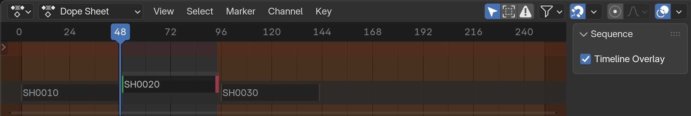

# Dope Sheet

This page covers overlays that are present in the Dope Sheet as well as the Action Editor and Timeline regions in Blender. These regions are tied to the active strip, and represent the internal timing of the Scene Strip's target Scene.

## Sequence Panel

### Timeline Overlay Boolean
Control the visibility of the Timeline Overlay with this boolean. When enabled **Strip Gizmos** representation of your timeline's Scene Strip timing will be displayed in the Dope Sheet, Action Editor or Timeline region.

## Timeline Overlay

### Strip Gizmo
Each Scene strip is represented by a gizmo indicated with the strip name overlaid onto the Dope Sheet, Action Editor or Timeline region. Only strips that are targeting the active Scene will be displayed.

### Adjust Timing
There are three ways to adjust timing of the Scene Strip from the Timeline Overlay. 

 - **Green Handle:** Adjusts the left handle of the scene strip. This will also "push/pull" any affected Scene Strips on the same Channel in the Sequencer Region.
 - **Red Handle:** Adjusts the right handle of the scene strip. This will also "push/pull"  any affected Scene Strips on the same Channel in the Sequencer Region. Similar to the [Adjust Timing](shot.md#adjust-shots-timing) operator in the Strip Menu.
 - **Upper Center Handle:** Select the top of the gizmo to [Slip Strip Content](https://docs.blender.org/manual/en/latest/video_editing/edit/montage/editing.html#slip-strip-contents). This will only affect the internal timing of the Scene Strip and will not affect the length of the strip.