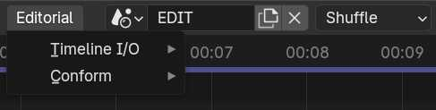
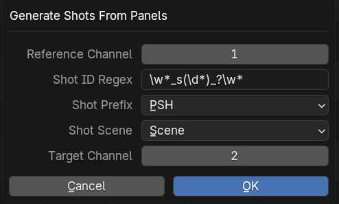
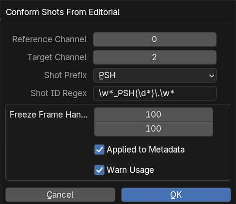

# Editorial

Editorial contains two important menus. Timeline I/O to import or export timelines and Conform for aligning/creating scene strips via an imported timeline.

## Timeline I/O
Timeline I/O menu contains operators for importing/exporting timelines to a non-linear editing software, utilizing [OpenTimelineIO](http://opentimeline.io/) python module. See [installation instructions](https://github.com/NickTiny/SPArk-sequencer-addon/blob/main/CONTRIBUTING.md#installing-opentimelineio).

### Import Timeline
Import an external timeline into the sequencer area. Supported file formats include; OTIO, XML, AAF & EDL.

### Export Timeline
Export the current sequencer area timeline to one of the following formats; OTIO, XML, AAF & EDL.

## Conform
Conform menu contains operators for modifying/generating scene strips based on a timeline that was imported with the **Import Timeline** operator above.

### Generate Shots from Panels

Generate scene strips based on clips in a previously imported timeline.

- **Reference Channel:** The channel containing the imported timeline to use as conformation reference.
- **Shot ID Regex:** Naming pattern to extract a Shot name from the timeline clips.
- **Shot Prefix:** Prefix to use on newly created shots. 
- **Shot Scene:** Each newly created Scene Strip will target this Scene.
- **Target Channel:** The channel to generate new Scene Strips onto.

### Conform Shots from Editorial

Conform existing scene strips to the timing from a previously imported timeline.

- **Reference Channel:** The channel containing the imported timeline to use as conformation reference.
- **Target Channel:** The channel containing scene strips to apply the conformation to.
- **Shot Prefix:** Prefix to use on newly created shots. 
- **Shot ID Regex:** Naming pattern to extract shot name from Scene Strips.
- **Freeze Frame Handles:** The duration of the handles found on the input media.
    - **Applied to Metadata:** Extend Scene Strip's internal range by the indicated Freeze Frame handles  (only using freeze frame handles). 
    - **Warn Usage:**  Color strips that exceed original source range (only using freeze frame handles).

