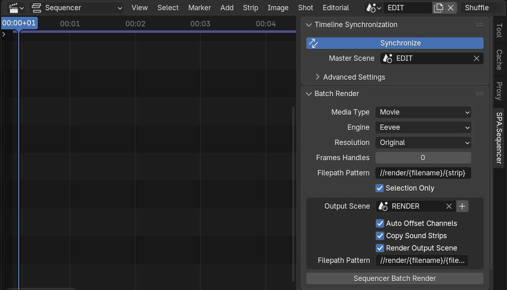

# Rendering

## Batch Render Panel

Rendering is the process of exporting the final frames of animation from the editing area into either Movie or Image files. This rendering workflow allows simple batch rendering of all or selected shots in the [Sequencer](https://docs.blender.org/manual/en/latest/editors/video_sequencer/sequencer/index.html). The render area allows for playback of the rendered images. Batch Render system only considers strips that are used by the sync system; muted strips, or strips outside the frame range will be ignored by the Batch Render system.

### Media Type
With options for either **Images** or **Movie** select the output format you desire for rendered sequence strip and output scene if enabled.

### Engine
Set which of Blender's render engines to use for rendering Scene Strips. Options include; **Eevee**, **Cycles**, and **Workbench**.

### Resolution
Select the resolution fraction to use for rendering Scene Strips. 
- **Original** The scene's native resolution. (100%)
- **1/2** Half of the scene's native resolution. (50%)
- **1/4** Quarter of the scene's native resolution. (25%)
- **1/8** Eighth of the scene's native resolution. (12%)

### Frame Handles
Render Extra frames before and after each scene strip. Allows for additional footage to be exposed for editing in an external Non-Linear Editing software. (Only Available with Media Type: Movie)

### Filepath Pattern
Define a custom file/folder naming scheme for each rendered Scene Strip. Variables are represented by using curly braces. Available variables are `{strip}`, `{scene}` & `{filename}`. 

### Selection Only
Only render the highlighted Scene Strips from the sequencer timeline.

### Output Scene
The current timeline (or selected elements within the timeline) will be re-constructed in the output scene. Useful for either reviewing your renders directly within Blender. Additionally rendering your output scene (option below) will create a single media (Movie/Image Sequence) that represents the entire timeline. *Note: Metastrips are not reconstructed in the output scene.*  

The outputs scene has several additional options:

- **Auto Offset Channels**: When rendering and re-rendering sequences, this option will always put new media on a higher channel, ensuring the current render doesn't overwrite any media that may already be in the Output Scene. 

- **Copy Sound Strips**: Often Sound Strips accompany your Scene Strips, usually representing music or dialogue. This option will copy these strips into the output scene. When used in combination with the **Auto Offset Channels** option your Sound Strips will also be offset.

- **Render Output Scene**: Renders the entire output scene including all copies strips to its own media, either Image or Movie depending on the option set in **Media Type**.

    - **Filepath Pattern**: Define a custom file naming scheme for the Output Scene render file(s). Only available if **Render Output Scene** is available.

    - **Use Default Color Management**: If enabled, temporarily override color management settings of output scene. `View Transform='Standard'` and `Look='None'` in the `sRGB` Color Space. Exposure, Gamma and Curve Mapping are also set to default values. CAUTION: If output scene uses AgX, Look value will not be restored to its original value. Only available if **Render Output Scene** is available.

### Sequencer Batch Render Operator
This operator will begin the Batch Render Process with the options provided above. First your Scene Strips will be rendered to the specified **Filepath Pattern**, in the desired **Media Type**. Secondly your Output Scene will be assembled. The Output Scene will also be rendered if enabled.  
