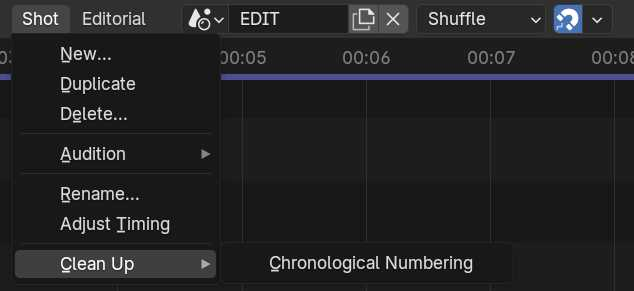
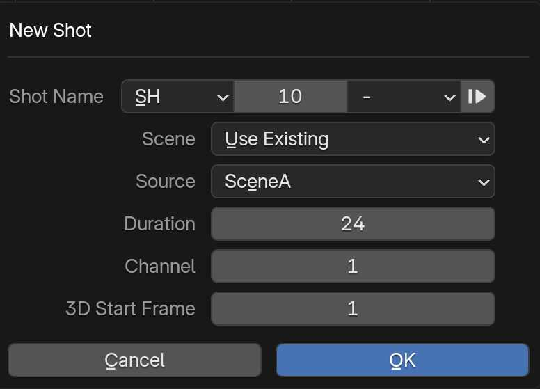
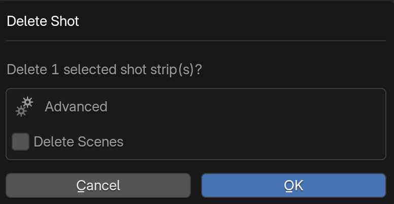
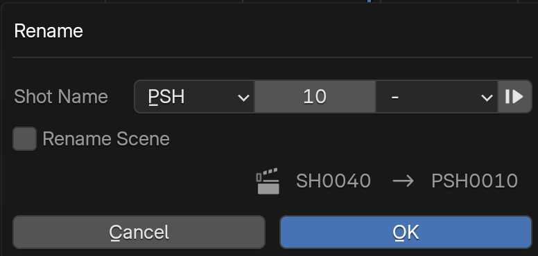
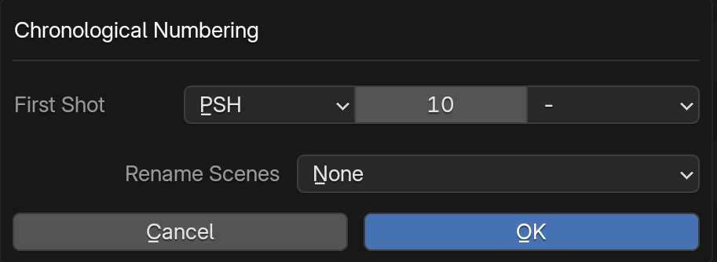

# Shots

## Shot Menu

The SPArk Sequencer Shot Menu offers unique controls that differ from Blender's native operators. 

### New Shot

To add a shot select **Shot > New** from the **Sequencer** Header Menu. **Use Existing** will copy the Scene from the active strip. 

- **Shot Name:** Set a Prefix/Number/Take: Use arrow to get the next available shot name.
- **Scene:** Use existing (most cases) or create a new scene from a Template.
- **Source:** Available scenes + templates (set in add-on preferences).
- **Duration:** Set the duration in frames.
- **Channel:** Select a row (aka channel) to place this new clip on, in the Sequencer.

### Duplicate Shot
When Duplicating a shot, the selected contents are appended to the end of your timeline, this also means that these clips are shifted in the Dope Sheet. To duplicate a shot without adjusting its timing use Blender's native [Strip Duplicate Operator](https://docs.blender.org/manual/en/latest/video_editing/edit/montage/editing.html#duplicate).

### Delete Shot

Each shot is associated with a scene. To delete a shot normally simply select Shot>Delete and leave Delete Scenes unchecked. To remove a shot and the associated scene use Shot>Delete and check the Delete Scenes option. Alternatively, see Blender's native [Strip Delete Operator](https://docs.blender.org/manual/en/latest/video_editing/edit/montage/editing.html#delete).

**Warning:** The **Delete Scenes** option will remove associated Scene data from the outliner.

### Adjust Shot’s Timing
Adjust timing will change the length of a strip in the sequencer and in the Dope Sheet. This will also "push" strips on the same channel to accommodate timing changes.

### Rename Shot

To rename a shot use **Shot>Rename**. This will work on a single shot at a time, use the arrow to get the next available shot number. Check **Rename Scene** to also rename the scene associated with this strip.

### Chronological Numbering

After editing your shot names may be out of order. To reset the numbering of all shots use **Shot>Cleanup>Chronological Numbering**. This will rename all shots based on the specified naming convention. Scenes can also be renamed by selecting a scene rename policy.

