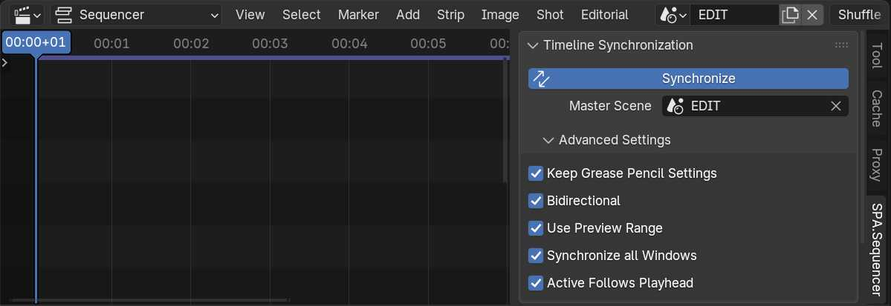

# Timeline Synchronization Panel

`Sequencer > Side Panel > SPA.Sequencer`

The Timeline Synchronization panel is the main control panel for your SPArk Sequencer experience. Use this panel to control what sequencer timeline you want to use for synchronization and what synchronization behaviors you expect. 

### Synchronize Operator
Toggle Synchronize System. When enabled SPArk Sequencer will handle synchronization between The Video Sequencer Editor and your 3D Viewport. All non-sequencer regions in Blender's windows will be updated to reflect the active scene strip.

### Master Scene
The Master Scene is conventionally the current timeline displayed in your Sequencer. This is the scene that contains the scene strips you want to use for synchronization. This is also the scene that will be targeted by the [Batch Render](render.md#batch-render-panel) panel.

### Keep Grease Pencil Settings
Keep the current active Grease Pencil brush while navigating between shots.

### Bidirectional
Update the current master scene time when scrubbing/playing back in the Scene Strip's Scene. For example when navigating the Action Editor / Dopesheet. 

### Use Preview Range
Set the preview range of the Scene Strip's Scene to the current range of the active strip. This will be reflected in Scene playback and can be viewed in the Action Editor/Dope Sheet

### Active Follows Playhead
Keep the current strip under the playhead as the active strip. This is useful when rapidly adjusting settings in the [strip properties editors](https://docs.blender.org/manual/en/latest/editors/properties_editor.html). For Metastrips, the inner scene strips will be set to active. 
