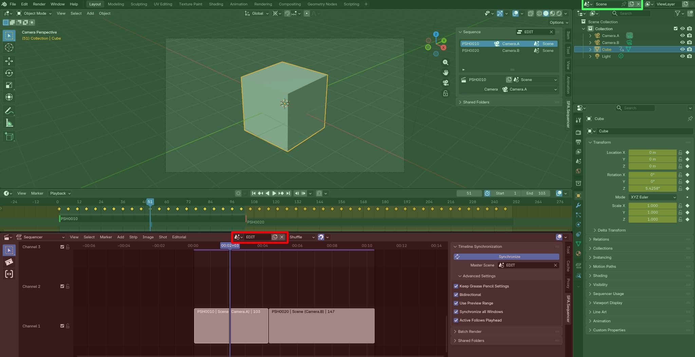
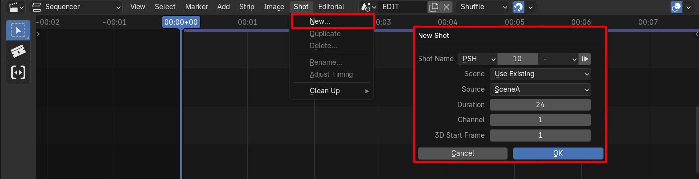
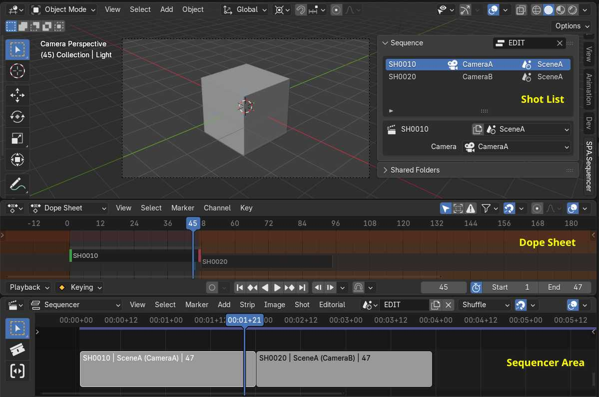
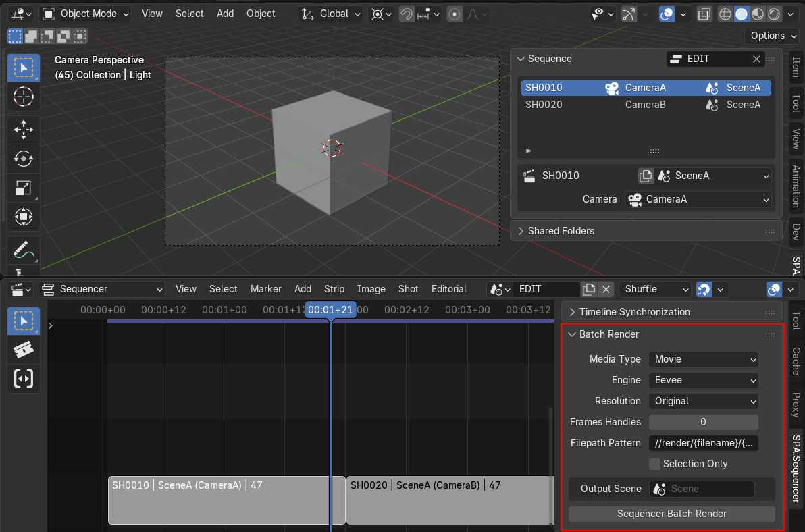

# Introduction

This page explains the typical workflow when using SPArk Sequencer Addon.

## Prerequisites

- [Install Add-On](installation.md)
- [Install OpenTimelineIO](../CONTRIBUTING.md#installing-opentimelineio) (optional)

## Understanding the UI
To understand how time impacts the interface refer to the below image. Green areas are part of your Layout Scene (standard Blender experience) and will behave as expected. Red areas are part of your Edit Scene and changes to the playhead in this area affect which layout scene, or what time is going to be displayed.

## Understanding Shots
A Sequence can be composed of a single “shot” or multiple “shots”. A shot is a container that points to a specific camera at a specific time in your Blender scene. Each camera can be used at different points in time, some cameras are reused multiple times. For more detail on how to manage Shots see [Shot Menu](shot.md).

## Scene Setup
Your blend file requires at least 2 Scenes.
1. One [Master Scene](sync.md#master-scene) which contains all your Scene Strips. 
2. At least one Target Scene which represents your 3D environment. 

## Setup Sync
1. Set your [Master Scene](sync.md#master-scene) in the Sync Panel.
2. Enable [Timeline Synchronization](sync.md#synchronize-operator).

## Your first shot
A shot is a container that points to a specific camera at a specific time in your Blender scene. To get started from the Sequencer header Menu find **Shot > New**. 

For more detail on how to add Shots see [New Shots](shot.md#new-shot)

## Navigating Between Shots
The 3D Viewport and Dope Sheet timeline interfaces can be synchronized with the master play-head from the Sequencer. When scrubbing from scene to scene in the sequencer, the corresponding scene content will be shown in the 3D Viewport and Dope Sheet. There are multiple ways to navigate between Shots in the SPArk Sequencer.

1. Selecting a Shot from the [Shot List](viewport.md#sequence-viewport-panel) in the 3D Viewport
1. Navigation with arrow keys in the [Dope Sheet](dopesheet.md) to jump between shots.
1. Playback / Scrubbing in the Sequencer area, ensure [Synchronization](sync.md#synchronize-operator) is enabled.

## Modify a Shot Camera/Scene
Each shot in the sequencer is linked to a scene and a camera. You can see a list of these shots and their corresponding data under the sequencer viewport panel. This is a comprehensive list of all the shots in your edit, the highlighted shot being the active shot on the current frame. 

- Use the [Scene Selector](viewport.md#scene-selector) to modify the active strip's scene. 
- Use the [Camera Selector](viewport.md#camera-selector) to modify the active strip's camera.

## Setting Frame Range for Render

In sequence workflow, we have many different scenes inside a single blend file. To adjust the timing of your sequence's final render, the master edit scene needs to have its frame range adjusted. Because the Sequencer workflow uses the master edit scene, we can set the frame range directly in the sequencer area.

1. Select all strips in your sequence
1. Navigate to the Sequencer area's header 
1. Selected **View>Range>Set Frame Range to Strips**

## Import and Conform Sequence from Timeline

SPArk Sequencer allows us to Import a timeline and automatically generate strips from it. To begin you will need an AAF/EDL/OTIO file from editorial.

1. Open Blender and Navigate to the Sequencer Region
1. From the Sequencer header select **Editorial>Timeline I/O>Import Timeline** to import a timeline into Sequencer
1. Enter the timeline path into the file browser and confirm
1. With your edit imported select **Editorial>Conform>Generate Shots from Panels** to create scene strips from the timeline.

See [Editorial Menu](editorial.md#editorial) for more details.

## Rendering
Use the Batch Render Panel in the Sequencer Area to Render your Scene Strips. You can render a selection, or all strips in the timeline. SPArk Sequencer also supports an "Output Scene" to review your render directly within Blender as well as render a single compiled movie of all your strips automatically.

See [Batch Render Panel](render.md#batch-render-panel) for more details.