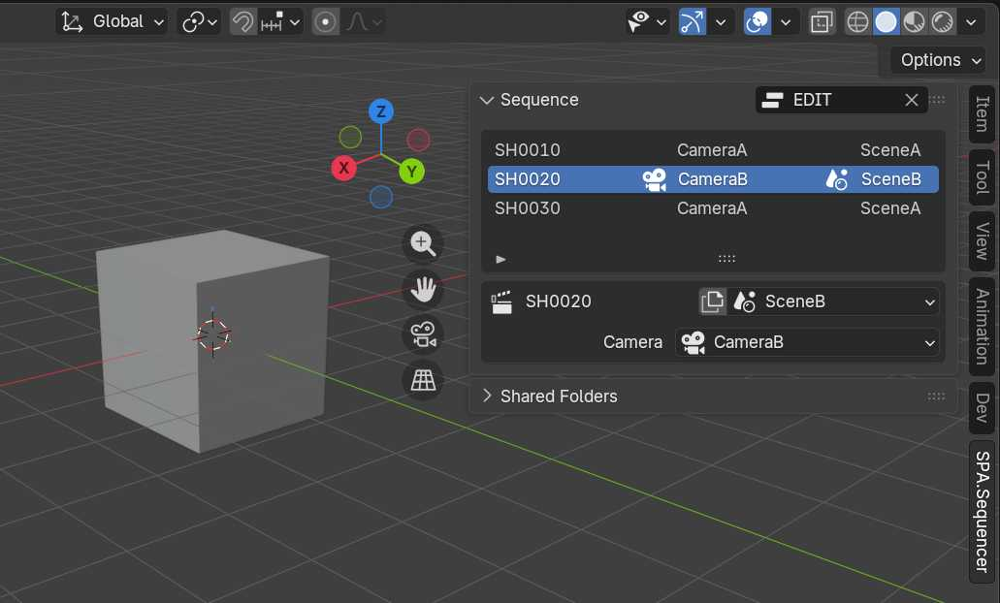
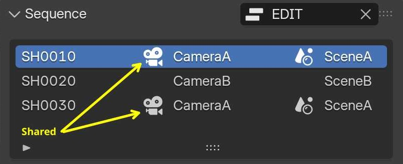
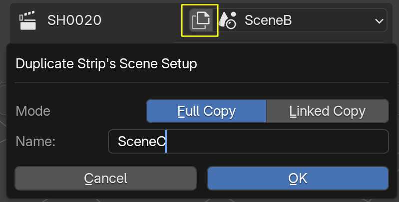
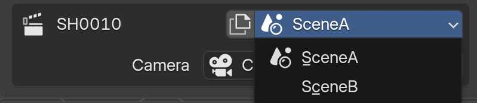
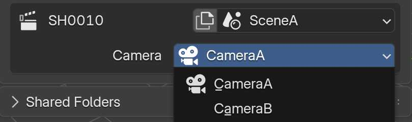

# Viewport

## Sequence Panel

**Note:** If Synchronization is not enabled in the [Sync Panel](sync.md#synchronize-operator) some functions below will be unavailable.

### Master Scene
The Master Scene is conventionally the current timeline displayed in your Sequencer. This is the same value that appears in the [Sync Panel](sync.md#master-scene) in the Sequencer.

### Shot List

The Shot List contains a list of the active Scene Strips in your sequence. The Active Strip is indicated with a Blue Highlight. You can select any item in the list to jump to the first frame of that strip in the Sequencer timeline. The columns of the Shot list from left to right represent; Shot name, Camera Name and Scene name. Cameras that are shared with the current active strip are indicated with a Camera Icon. Scenes that are shared with the current active strip are indicated with a Scene Icon.

### Scene Duplicate

Indicated with a "Copy Icon" next to the Scene Selector. This operator allows for either a **Full Copy** or **Linked Copy** of the current Scene to be assigned to the current Active Strip. When using **Linked Copy** a new collection unique to the new scene will be created, named after the Scene.

### Scene Selector

Dropdown Menu with the active strip's Scene name. Click this dropdown to open a list of available Scenes in the file (excluding the master scene).

### Camera Selector

Dropdown Menu with the active strip's Camera name. Click this dropdown to open a list of available Cameras in the current Scene.
