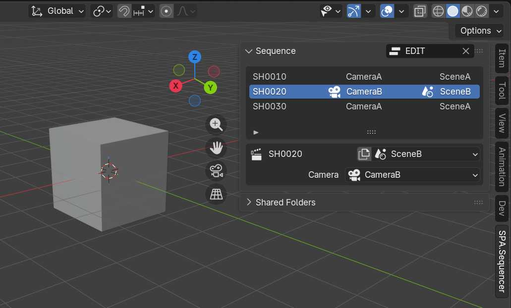
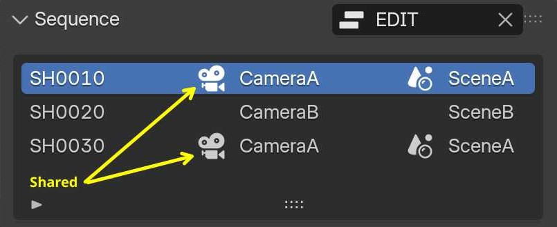
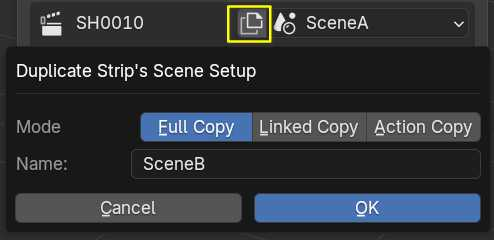
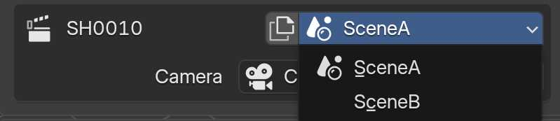
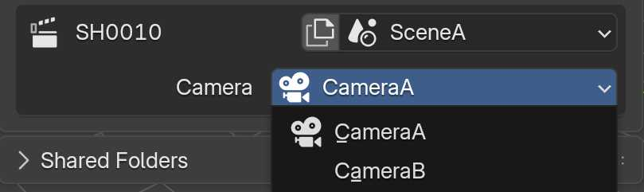

# Viewport

## Sequence Panel

**Note:** If Synchronization is not enabled in the [Sync Panel](sync.md#synchronize-operator) some functions below will be unavailable.

### Master Scene
The Master Scene is conventionally the current timeline displayed in your Sequencer. This is the same value that appears in the [Sync Panel](sync.md#master-scene) in the Sequencer.

### Shot List

The Shot List contains a list of the active Scene Strips in your sequence. The Active Strip is indicated with a Blue Highlight. You can select any item in the list to jump to the first frame of that strip in the Sequencer timeline. The columns of the Shot list from left to right represent; Shot name, Camera Name and Scene name. Cameras that are shared with the current active strip are indicated with a Camera Icon. Scenes that are shared with the current active strip are indicated with a Scene Icon. Muted strips are hidden from shot list. Strips nested inside Metastrips are included in the Shot List.

### Scene Duplicate

Duplicates thee active Scene Strip's target Scene. Indicated with a "Copy Icon" next to the [Scene Selector](viewport.md#scene-selector). This operator has the following modes: 

- **Full Copy**: Creates a full copy of all objects and data (meshes) into a new Scene. Objects, actions, meshes and other Scene data are not shared. See Blender's native [Scene Copy Operator](https://docs.blender.org/manual/en/latest/video_editing/edit/montage/editing.html#delete).
- **Linked Copy**: Creates a new scene with the same objects and data (meshes) linked into the Scene. Objects, actions, meshes and other Scene data are shared. Additionally a new collection unique to the new scene will be created, named after the Scene.
- **Action Copy**: Creates a new scene, only animated objects are duplicated. Animated objects and actions are unique to this scene. Static objects, meshes and other Scene data are shared. All parents collections of any animated object will be duplicated.

**Note** Action copies can be created on a per object basis by Right Clicking an object in the outliner and selecting "Action Copy Selected Objects".

### Scene Selector

Dropdown Menu with the active strip's Scene name. Click this dropdown to open a list of available Scenes in the file (excluding the master scene).

### Camera Selector

Dropdown Menu with the active strip's Camera name. Click this dropdown to open a list of available Cameras in the current Scene.
